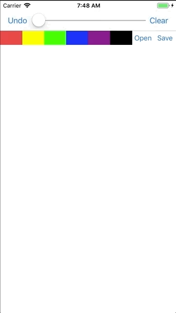

# # Fall 2018 :: CSE 438 Lab 3 - Drawing App
It is a simple drawing app.

# # Build Environment
  - Xcode 9.4
  - Swift 4
  - iPhone 8

# # Features
  - Users can draw continuous and smooth lines by tapping and dragging.
  - Users can “undo” to erase the previous line drawn. 
  - Users can use multiple color and change thickness of the line.
  - Users can clear the screen.
  - Users can open an image from the photo library and display it on the screen. 
  - Users can save the current drawing.

# # Design Choices
  - When an image is loaded, it will be set to a UIImageView, and this will be added on top of the current view.
  - When users clear the view, every subview of the root view is removed in order to handle the case where users open images in a row, which will result in adding views on top of views.

# # Demo
> The following demo shows the basic functionality of this app.
>   
>   
>
> The following demo shows the saving feature of the app.  
>   
> 
>  
> The following demo shows the opening feature of the app.  
>   
